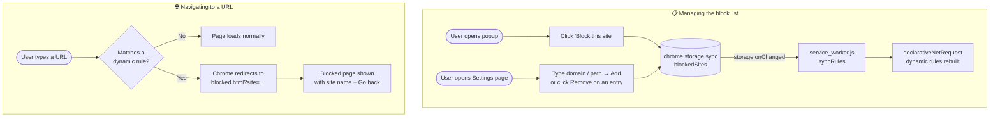

# BlockSites

A lightweight Chrome extension that lets you block distracting websites. Add any site to your block list and every future visit is redirected to a friendly blocked page instead.

## What it does

- **Block any site** — add a domain (`facebook.com`) or a specific path (`reddit.com/r/news`) to your block list.
- **One-click quick-add** — open the popup while visiting a site and click **Block this site** to add it instantly.
- **Manage your list** — view, add, or remove blocked sites from the settings page at any time.
- **Redirect, don't just hide** — blocked sites are intercepted at the network level and replaced with a clear blocked page.

### Popup

> Load the extension first, then replace this line with a screenshot: ``

## Installation

BlockSites is not on the Chrome Web Store — install it as an unpacked extension in Developer Mode.

1. **Download the source**

   Clone this repo or download and unzip it:
   ```bash
   git clone https://github.com/xzysolitaire/BlockSites.git
   ```

2. **Open Chrome Extensions**

   Go to `chrome://extensions` in your browser.

3. **Enable Developer Mode**

   Toggle **Developer mode** on (top-right corner of the page).

4. **Load the extension**

   Click **Load unpacked**, then select the `BlockSites` folder.

5. **Pin it (optional)**

   Click the puzzle-piece icon in the Chrome toolbar → find **BlockSites** → click the pin icon so the popup is always one click away.

## Usage

| What you want to do | How |
|---|---|
| Block the site you're on | Click the BlockSites toolbar icon → **Block this site** |
| Block a site manually | Click **Manage block list** → type a domain or path → **Add** |
| Unblock a site | Click **Manage block list** → click **Remove** next to the entry |

## How blocking works

There are two independent flows: **managing the block list** and **navigating to a URL**.



**Key components:**

| Component | Role |
|---|---|
| `service_worker.js` | Listens for storage changes; rebuilds `declarativeNetRequest` rules |
| `chrome.storage.sync` | Single source of truth for the block list; syncs across devices |
| `declarativeNetRequest` | Chrome API that intercepts matching requests before they leave the browser |
| `blocked.html` | Redirect target; reads the blocked domain from the URL query string |
